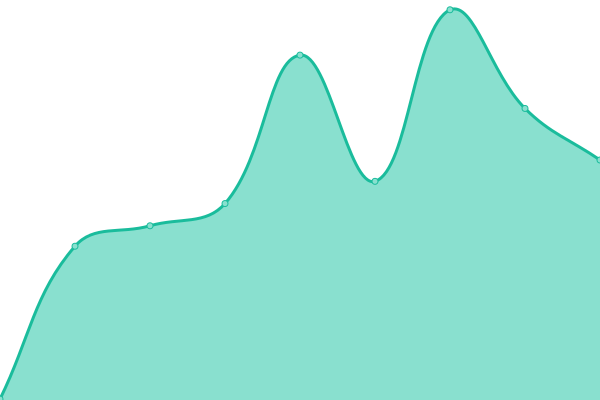
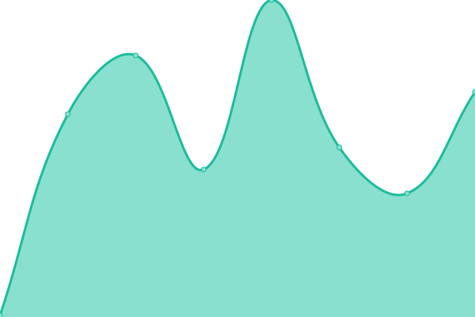
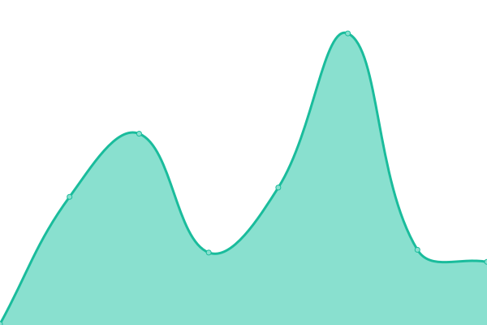
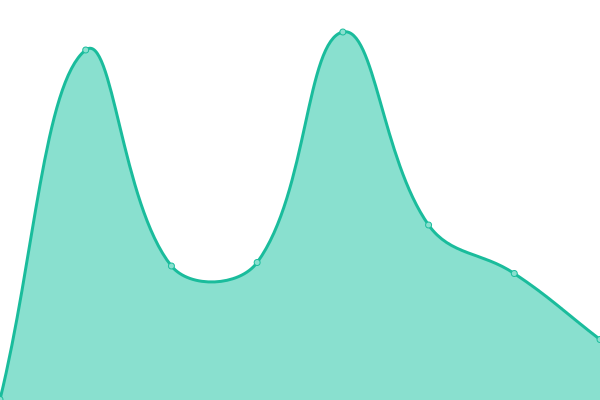
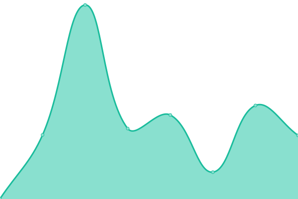
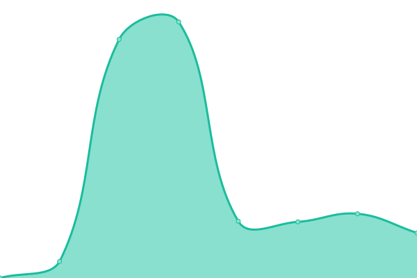

# [📈 Live Status](https://tigefabot.github.io/status): <!--live status--> **🟧 Partial outage**

This repository contains the open-source uptime monitor and status page for [Tigefa Hubot](https://tigefa.github.io), powered by [Upptime](https://github.com/upptime/upptime).

With [Upptime](https://upptime.js.org), you can get your own unlimited and free uptime monitor and status page, powered entirely by a GitHub repository. We use [Issues](https://github.com/tigefabot/status/issues) as incident reports, [Actions](https://github.com/tigefabot/status/actions) as uptime monitors, and [Pages](https://tigefabot.github.io/status) for the status page.

<!--start: status pages-->
<!-- This summary is generated by Upptime (https://github.com/upptime/upptime) -->
<!-- Do not edit this manually, your changes will be overwritten -->
<!-- prettier-ignore -->
| URL | Status | History | Response Time | Uptime |
| --- | ------ | ------- | ------------- | ------ |
|  [Tigefa](https://tigefa.com) | 🟥 Down | [tigefa.yml](https://github.com/tigefabot/status/commits/HEAD/history/tigefa.yml) | 

 384ms
     
 | 

<a href="https://tigefabot.github.io/status/history/tigefa">90.73%</a>
    

|  [Tigefa Neet](https://tigefa.net) | 🟥 Down | [tigefa-neet.yml](https://github.com/tigefabot/status/commits/HEAD/history/tigefa-neet.yml) | 

 155ms
     
 | 

<a href="https://tigefabot.github.io/status/history/tigefa-neet">38.95%</a>
    

|  [Minio](https://tigefa.site) | 🟥 Down | [minio.yml](https://github.com/tigefabot/status/commits/HEAD/history/minio.yml) | 

 0ms
     
 | 

<a href="https://tigefabot.github.io/status/history/minio">0.00%</a>
    

|  [Tigefa.win](https://tigefa.win) | 🟥 Down | [tigefa-win.yml](https://github.com/tigefabot/status/commits/HEAD/history/tigefa-win.yml) | 

 0ms
     
 | 

<a href="https://tigefabot.github.io/status/history/tigefa-win">0.00%</a>
    

|  [Tigefa blog](https://tigefa.my.id) | 🟩 Up | [tigefa-blog.yml](https://github.com/tigefabot/status/commits/HEAD/history/tigefa-blog.yml) | 

 329ms
     
 | 

<a href="https://tigefabot.github.io/status/history/tigefa-blog">100.00%</a>
    

|  [Plausible](https://plausible.my.id) | 🟩 Up | [plausible.yml](https://github.com/tigefabot/status/commits/HEAD/history/plausible.yml) | 

 313ms
     
 | 

<a href="https://tigefabot.github.io/status/history/plausible">100.00%</a>
    

|  [PrivateBin](https://privatebin.my.id) | 🟩 Up | [private-bin.yml](https://github.com/tigefabot/status/commits/HEAD/history/private-bin.yml) | 

 313ms
     
 | 

<a href="https://tigefabot.github.io/status/history/private-bin">100.00%</a>
    

|  [Yourls](https://urls.my.id) | 🟩 Up | [yourls.yml](https://github.com/tigefabot/status/commits/HEAD/history/yourls.yml) | 

 347ms
     
 | 

<a href="https://tigefabot.github.io/status/history/yourls">100.00%</a>
    

|  [cURLs.top](https://curls.top) | 🟥 Down | [c-ur-ls-top.yml](https://github.com/tigefabot/status/commits/HEAD/history/c-ur-ls-top.yml) | 

 0ms
     
 | 

<a href="https://tigefabot.github.io/status/history/c-ur-ls-top">0.00%</a>
    

|  [Kodev](https://kodev.my.id) | 🟥 Down | [kodev.yml](https://github.com/tigefabot/status/commits/HEAD/history/kodev.yml) | 

 8225ms
     
 | 

<a href="https://tigefabot.github.io/status/history/kodev">0.00%</a>
    

<!--end: status pages-->

[**Visit our status website →**](https://tigefabot.github.io/status)

## 📄 License

- Powered by: [Upptime](https://github.com/upptime/upptime)
- Code: [MIT](./LICENSE) © [Tigefa Hubot](https://tigefa.github.io)
- Data in the `./history` directory: [Open Database License](https://opendatacommons.org/licenses/odbl/1-0/)
